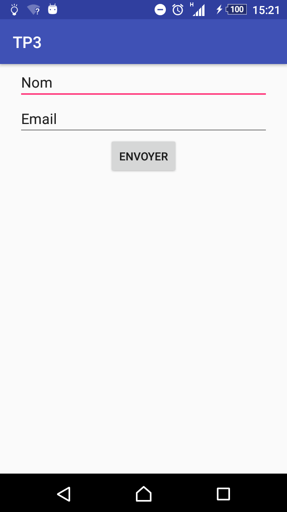
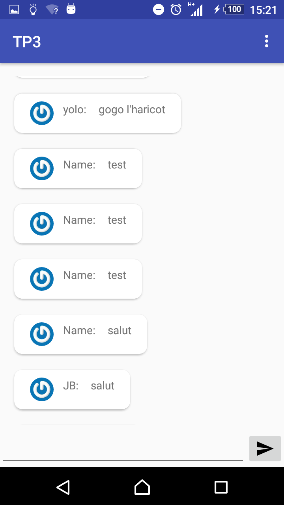

# TPAndroid - TP3

Cette application permet d'échanger des messages avec différents internautes via la base de données FireBase. En lançant l'application, l'utilisateur va pouvoir saisir son identifiant et son adresse email pour se connecter. Il va alors accéder à l'activité principale, présentant le chat.

L'ensemble des principales questions a été réalisé (notamment la mise en place de Glide et l'affichage des avatars récupérés de Gravatar) et plusieurs bonus ont été effectués comme la récupération automatique de l'adresse email de l'utilisateur, la mise en place d'un logo personnalisé pour l'application, l'affichage de la date d'envoie dynamique (elle s'actualise en scrollant le chat) et la mise en place du bouton permettant de se déconnecter et de revenir à l'activité de login.

Pour récupérer et tester ce projet, il suffit de le télécharger ou le cloner à partir de Github, de le lancer sur Android-Studio et de lancer l'application sur un téléphone ou via un émulateur.

Quelques précisions :
- Le TP étant la suite du TP2, j'ai préféré partir de la correction du TP précédent. C'est pourquoi il peut encore y avoir votre nom et prénom à certains endroits (comme dans le Logcat).
- L'activité principale du chat semble mettre un certain temps avant de s'afficher (probablement dû au fait des nombreux traitements effectués et des connexions, notamment vers Firebase

## Screenshots

  

L'activité permettant de choisir son identifiant et son adresse email.

  

L'activité principale, où sont affichés les messages des différents utilisateurs et où ils peuvent être saisis.

## License

Copyright 2017 The Android Open Source Project, Inc.

Licensed to the Apache Software Foundation (ASF) under one or more contributor license agreements. See the NOTICE file distributed with this work for additional information regarding copyright ownership. The ASF licenses this file to you under the Apache License, Version 2.0 (the "License"); you may not use this file except in compliance with the License. You may obtain a copy of the License at

http://www.apache.org/licenses/LICENSE-2.0

Unless required by applicable law or agreed to in writing, software distributed under the License is distributed on an "AS IS" BASIS, WITHOUT WARRANTIES OR CONDITIONS OF ANY KIND, either express or implied. See the License for the specific language governing permissions and limitations under the License.
